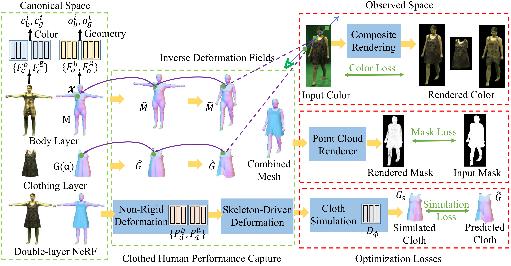

# Clothed Human Performance Capture with a Double-layer Neural Radiance Fields

### [Project Page](https://wangkangkan.github.io/project_pages/ClothedHumanCap/index.html) | [Video](https://wangkangkan.github.io/project_pages/ClothedHumanCap/video/introduction.mp4) | [Paper](https://openaccess.thecvf.com/content/CVPR2023/papers/Wang_Clothed_Human_Performance_Capture_With_a_Double-Layer_Neural_Radiance_Fields_CVPR_2023_paper.pdf)

> Kangkan Wang*, Guofeng Zhang, Suxu Cong, Jian Yang;



Official implementation of Clothed Human Performance Capture with a Double-layer Neural Radiance Fields.

Questions and discussions are welcomed! Feel freely to contact Kangkan Wang via [wangkangkan@njust.edu.cn](mailto:wangkangkan@njust.edu.cn).

## Installation

### Set up python environment

```bash
conda create -n nerfcap python=3.9
conda activate nerfcap

# Install pytorch==1.9.1
conda install pytorch==1.9.1 torchvision==0.10.1 torchaudio==0.9.1 cudatoolkit=11.3 -c pytorch -c conda-forge
pip install torch==1.9.1+cu111 torchvision==0.10.1+cu111 torchaudio==0.9.1 -f https://download.pytorch.org/whl/torch_stable.html

pip install -r requirements.txt
```

Install [pytorch3d](https://github.com/facebookresearch/pytorch3d/tree/main),Please refer to [INSTALL.md](https://github.com/facebookresearch/pytorch3d/blob/main/INSTALL.md) for detailed installation.

```bash
# Install iopath fvcore
pip install -U 'git+https://github.com/facebookresearch/iopath'
pip install -U 'git+https://github.com/facebookresearch/fvcore'

# For cuda < 11.7
conda install -c bottler nvidiacub

# For cuda >= 11.7
curl -LO https://github.com/NVIDIA/cub/archive/1.10.0.tar.gz
tar xzf 1.10.0.tar.gz
export CUB_HOME=$PWD/cub-1.10.0

# Install pytorch3d
pip install "git+https://github.com/facebookresearch/pytorch3d.git@stable"

# Bulid from source
# wget https://github.com/facebookresearch/pytorch3d/archive/refs/tags/v0.7.1.tar.gz -O pytorch3d.tar.gz
# tar -zxvf pytorch3d.tar.gz
# cd pytorch3d-0.7.1
# python3 setup.py install
```

### Set up dataset

Download DeepCap dataset [here](https://gvv-assets.mpi-inf.mpg.de/).

## Run the code on DeepCap Dataset

### Test

1. Download the corresponding pretrained model and put it to `$ROOT/data/trained_model/if_nerf/magdalena/latest.pth`
2. Test and visualization
   - Visualize all frames at test views `python run.py --type visualize --cfg_file configs/magdalena/magdalena.yaml exp_name magdalena`
   - Simultaneously extract mesh at each frame `python run.py --type visualize --cfg_file configs/magdalena/magdalena.yaml exp_name magdalena vis_mesh True`
3. The result are located at `$ROOT/data/result/if_nerf/magdalena`

### Train

1. Train `python train_net.py --cfg_file configs/magdalena/magdalena.yaml exp_name magdalena resume False`
2. Tensorboard `tensorboard --logdir data/record/if_nerf`

## Citation

```
@InProceedings{Wang_2023_CVPR,
author={Wang, Kangkan and Zhang, Guofeng and Cong, Suxu and Yang, Jian},
title={Clothed Human Performance Capture With a Double-Layer Neural Radiance Fields},
booktitl= {Proceedings of the IEEE/CVF Conference on Computer Vision and Pattern Recognition (CVPR)},
month={June},
year={2023},
pages={21098-21107}}
```
